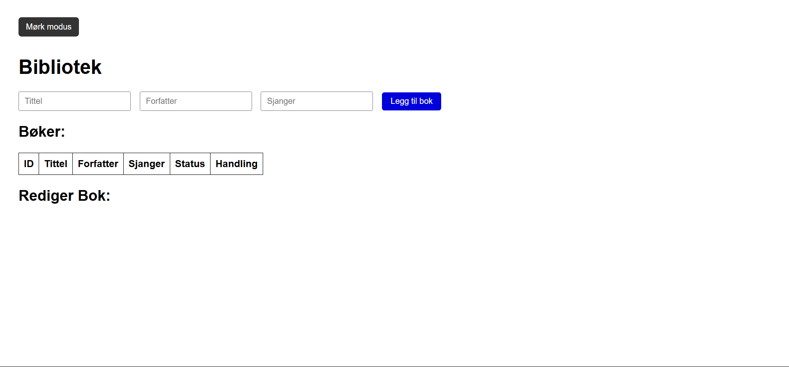
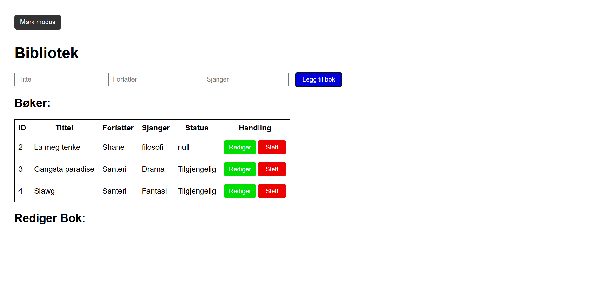
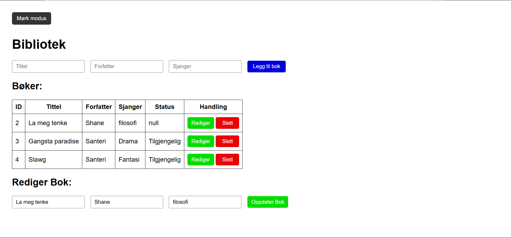
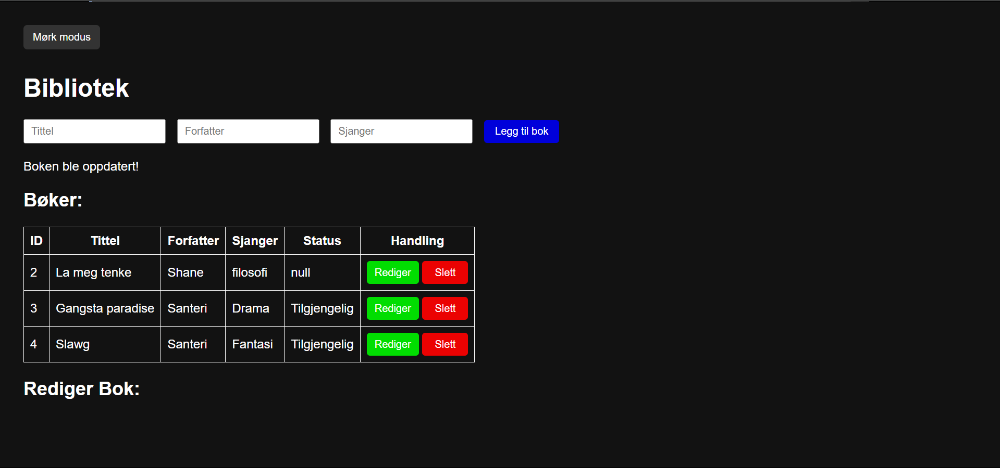

<h1 align="center">Bibliotek administrasjonssystem</h1>

  <h3>
    <a href="https://github.com/SanteriWille/mySQL2">
      Lenken til prosjektet
    </a>
  </h3>

<!-- TABLE OF CONTENTS -->

## Table of Contents

- [Overview](#overview)
- [Built With](#built-with)
- [Features](#features)
- [How to use](#how-to-use)
- [Contact](#contact)

<!-- OVERVIEW -->
## Overview
Se nederst

### Built With
- [HTML](https://www.w3schools.com/html/)
- [CSS](https://www.w3schools.com/css/default.asp)
- [Javscript]
- [Node.js](https://nodejs.org/en)
- [Express.js](https://expressjs.com/)
- [MySQL](https://www.mysql.com/)
- [Postman](https://www.postman.com/)

## Features
- Legge til nye bøker i databasen
- Oppdatere informasjon om eksisterende bøker
- Slette bøker fra databasen
- Vise alle tilgjengelige bøker
- Mørk modus

## How To Use
1. Installer avhengigheter

Kjør følgende kommando for å installere nødvendige pakker: npm install

2. Koble til MySQL-database

Opprett en MySQL-database og oppdater db.js med dine databaseopplysninger.

3. Start serveren
node server.js eller nodemon server.js

4. Test API-et

Bruk Postman eller en nettleser til å teste API-endepunktene.

## Future Plans
- Implementere brukersystem med autentisering
- Mulighet for å søke etter bøker
- Filopplasting for bokomslag

## Contact
- Github [Santeri Wille](https://github.com/SanteriWille)
- Epost [Santeri Wille](mailto:santeriwille@gmail.com)

## Happy coding!

## Forventet resultat

